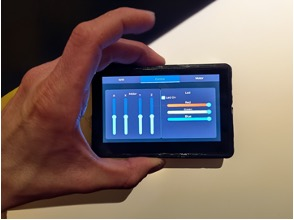

# ESP32-S3 Info Screen for UC2 Microscope Control

This repository contains code for an ESP32-S3 based display designed to control various aspects of a microscope setup, including stage movements (XYZ), laser intensity, LED array color, and sending custom messages to trigger actions in ImSwitch. The hardware used is the [Waveshare ESP32-S3 Touch LCD 4.3"](https://www.waveshare.com/esp32-s3-touch-lcd-4.3.htm).

## Showcase 



## Table of Contents
- [Introduction](#introduction)
- [Features](#features)
- [Hardware Requirements](#hardware-requirements)
- [Software Requirements](#software-requirements)
- [Installation](#installation)
- [Usage](#usage)
- [Contributing](#contributing)
- [License](#license)

## Introduction

This project aims to provide an intuitive interface for controlling microscope components via an ESP32-S3 microcontroller and a touchscreen display. The system integrates with ImSwitch for triggering acquisitions and controlling other microscope features.

## Features

- Control microscope stage movements (X, Y, Z)
- Adjust laser intensity
- Change LED array color
- Send custom messages to trigger actions in ImSwitch
- User-friendly touchscreen interface

## Hardware Requirements

- [Waveshare ESP32-S3 Touch LCD 4.3"](https://www.waveshare.com/esp32-s3-touch-lcd-4.3.htm)
- Microscope setup with controllable stage, laser, and LED array

## Software Requirements

- PlatformIO
- LVGL library
- ESP32 libraries

## Installation

1. Clone the repository:
   ```bash
   git clone https://github.com/openUC2/openUC2-ESP32InfoScreen.git
   cd openUC2-ESP32InfoScreen
   ```

2. Install the required libraries using PlatformIO:
   ```bash
   pio lib install
   ```

3. Configure the project:
   Edit the `platformio.ini` file to match your hardware setup.

4. Build and upload the code to your ESP32-S3:
   ```bash
   pio run --target upload
   ```

## Usage

After uploading the code, the touchscreen interface will allow you to:
- Move the microscope stage in X, Y, Z directions.
- Adjust the intensity of the laser.
- Change the color and intensity of the LED array.
- Send custom commands to ImSwitch.

For more detailed information, you can refer to the [src](https://github.com/openUC2/openUC2-ESP32InfoScreen/tree/main/src), [include](https://github.com/openUC2/openUC2-ESP32InfoScreen/tree/main/include), and [lib](https://github.com/openUC2/openUC2-ESP32InfoScreen/tree/main/lib) directories in the repository.

## Contributing

Contributions are welcome! Please fork the repository and submit pull requests for any improvements or bug fixes.

## License

This project is licensed under the MIT License. See the [LICENSE](LICENSE) file for details.

